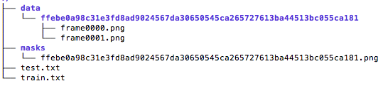
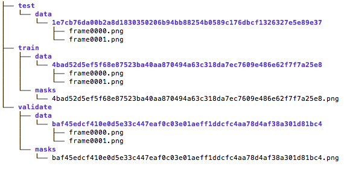

# team-linden-p2 - Project 2 CSCI-8360 : Cilia Segmentation
## Team-linden

## Member (Ordered by last name alphabetically)
* Abolfazl Farahani (a.farahani@uga.edu)
* Jonathan Myers (submyers@uga.edu)
* Jiahao Xu (jiahaoxu@uga.edu

## Synopsis

We provide approaches for finding cellular cilia from films using Tiramisu Convolutional Neural Networks (CNN) and Optical Flow Threshold techniques. Here we apply those techniques to existing data sets to evaluate their performance and provide tools for others to apply and continue expansion. These endeavors come as the second project in the Spring 2019 University of Georgia CSCI 8360 course Data Science Practicum. 

## Outline

We provide Python scripts for predicting which regions in a series of cellular video png files contain cilia. Our package contains the following:

* img/ : Directory containing images referenced by our documentation
* src/ : Contains scripts referenced by the scripts in this directory
* doc/ : Directory contains the assignment on which this project was built
* FormatImageData.py : Script you can use to download and/or format png images
* RunOpticalFlow.py : Script allows you to Optical Flow analysis to png images
* BuildTiramisuData.py : Takes data in format used by FormatImageData.py and output data in format necessary to used Tiramisu scripts
* TrainTiramisu.py : Builds a set of Tiramisu CNNs by using training and validation data
* TestTiramisu.py : Applies a target Tiramisu CNN to  a test set and generates prediction images

## Expectations

You might not have all the Python packages expected by our scripts. If you see any errors from Python stating you don't have an expected package, for instance you don't have "torch", use pip to install the package in question; here's an example:

```
$ pip install torch
```

Our two main approaches expect different data structure in the source directory. Optical Flow expects a data structure that conforms with the data provided by Dr. Quinn for this assignment; the following image gives a brief summary of the expected directories and some of their content:

<p align="center">

</p>

If this is your first time working with such data, you may execute the following commands to download all of Quinn's data to a local directory (please not this process will leave you with two directories containing everything):

```
$ mkdir ~/cilia
$ mkdir ~/cilia/SetOne
$ python FormatImageData.py -s ~/cilia/SetOne -g gs://uga-dsp/project2 -o ~/cilia/OpticalFlowData
```

The Tiramisu CNN software has different data organization expectations because a training should be separated into training and validate sets to regulate how the CNN is built. The following image illustrates the general layout expectation:

<p align="center">
    
</p>

If you have data in a directory that agrees with this assignment's data layout, the script BuildTiramisuData.py will take data from your directory and randomly divide the training set into a training set and a validate set (argument -v specifies the size of the validate set and -s specifies the random seed used to select such memebers):

```
$ python BuildTiramisuData -r ~/cilia/SetOne -v 40 -s 1 -o ~/cilia/tiramisuData
```

Once you've executes the commands listed above, or confirmed you have a directory that matches the data organization expectations of the Optical Flow and/or Tiramisu scripts, you may proceed.

## Image Formatting

While the script FormatImageData.py can download example data for you, as noted in the previous section, it can also format the images which define the cellular videos. We highly recommend you format your images using this script before using the Optical Flow script or preparing your data for Tiramisu CNN with BuildTiramisuData.py. Following the example actions shown above, we recommend executing the following:

```
$ python FormatImageData.py -s ~/cilia/SetOne -o ~/cilia/OpticalFlowData -clahe -bf -gb -vs
```

The arguments -clahe, -bf, -gb, and -vs signify the application different image formatting approaches using default values (read our wiki page for more details and references)

## Optical Flow

One you have data in the format expected by Optical Flow (see earlier section or our wiki page for any questions regarding expectations), you are ready to apply the python script RunOptimalFlow.py to your data. Following the example actions shown above, you could execute the script with the following command:

```
$ python RunOpticalFlow.py -r ~/cilia/OpticalFlowData -o ~/cilia/OpticalFlowOutput -opFlow
```

This will run the Optical Flow process, print much data to standard out to let you know it is processing, and finish with output images being written to the ~/cilia/OpticalFlowOutput directory.

## Tiramisu CNN

To start, make sure you have data in a directory that conforms with Tiramisu CNN validate data organization expectations that has undergone formatting. Following the example actions shown above, you could execute the following to prepare for training Tiramisu CNN models:

```
$ python BuildTiramisuData -r ~/cilia/OpticalFlowData -v 40 -s 1 -o ~/cilia/tiramisuData
```

This will give you a random validate set of size 40. Now you are ready to train the Tiramisu CNN by calling the TrainTiramisu.py script, following the example still you could execute:

```
$ python TrainTiramisu.py -ab -r ~/cilia/tiramisuData -bs 1 -rc 96 -lr 1e-4 -flr 1e-4 -de 1 -lrd 0.995 -ne 5 -wd 1e-4
```

You will see standard output explaining how well the different Tiramisu CNN perform on the verification set. Once the process completes, you will see the file adabound_accuracy.txt (because you selected the "-ab" option) in the ~/cilia/tiramisuData directory. The file states which model performed best. You can then generate predictions on the test set with the following command:

```
$ python RestTiramisu.py r ~/cilia/tiramisuData -tm ~/cilia/tiramisuData/weights/ -o ~/cilia/tiramisuData/results
```

The script will fill the ~/cilia/tiramisuData/results directory with mask prediction png files for each member of the test set.

## Final Notes

This website hopes to serve as a first step. These scripts provide many options you may use to test ideas and combinations we have not. Feel free to look at the source code and reference our wiki page to gain greater understand on what is possible.


