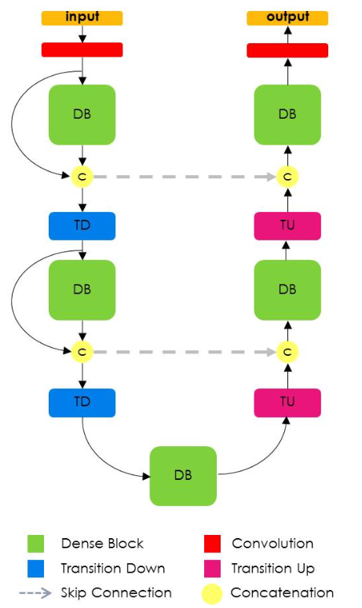

# team-linden-p2# Project 2 CSCI-8360 : Cilia Segmentation
## Team-linden

## Member (Ordered by last name alphabetically)
* Abolfazl Farahani (a.farahani@uga.edu)
* Jonathan Myers (submyers@uga.edu)
* Jiahao Xu (jiahaoxu@uga.edu

## Synopsis

We provide approaches for finding cellular cilia from films using Tiramisu Convolutional Neural Networks (CNN) and Optical Flow Threshold techniques. Here we apply those techniques to existing data sets to evaluate their performance and provide tools for others to apply and continue expansion. These endeavors come as the second project in the Spring 2019 University of Georgia CSCI 8360 course Data Science Practicum. 

## Outline

Historians credit Antonie Philips van Leeuwenhoek for the September 1675 discovery of cilia [Peter Satir]. While this served as landmark organelle discovery, microscope limitations held back confident analysis for centuries; thereby leaving little incentive for continued research. Despite the 20th century's rapid advances in techniques for cellular analysis, decades passed without provocative research discoveries, though functional understanding grew impressively. Advances in the 1990's found cilia provide intraciliary/intraflagellar transport (ITF), an operation by which material may be shared between cells [KG Kozminski]. Soon thereafter, researchers discovered many instances where cilia ITF function correlated with genes and cellular function, including the Autosomal Recessive Polycystic Kidney Disease (ARPKD) linking hydromorphic allele with dramatic defects [JH Moyer]. As cellular data continues rapid growth, the opportunities to derive correlation patterns between cilia data and symptoms/application show rising potential.

The derivation of patterns by which one could predict potential events, with rational certainty, primarily comes from statistical modeling. The rapid advances in data science techniques have brought about many opportunities to derive cilia's applicability. Crossing the expanding data science technical abilities with advanced cellular understanding have, in part, lead to the challenge of this project: automatically deriving which sections of a video are cilia. With accurate identification of cilia regions, scientists will have more data for integration with other statistical models to broaden the scope of predicting cellular function.

As part of the Spring 2019 University of Georgia CSCI 8360 course, this project's scope is limited to a predefined set of cellular videos along with mask images signifying which areas should be classified as cilia and which should not (please look in the doc directory for a copy of the assignment). To achieve the goals presented in this assignment, that being to accurately predict which regions should be classified as cilia, we implemented Python scripts that use Tiramisu CNN and Optical Flow Threshold techniques. The following sections discuss how to use this software. For more information regarding how the software was implemented along with discussions on other ideas tested and potential areas for future progress, please visit our Github wiki page.

The following sections will discuss data and organization expected by our Python script, how to effectively execute our scripts, and utility scripts that maybe helpful with further experiment.

## Data Organization

Being our course's second project assignment, it carries expectations regarding data we should expect and data we should generate. In this section we discuss the intrinsic data structure and format of our software, and how the two methods both expect different setup. We also built scripts that will allow you to get the data we used for the project along with another script (FormatImageData.py) that could translate the structure expected by Optical Flow into the structure expected by Tiramisu CNN.

Dr. Shannon Quinn provide us with a data directory consisting of the following:

<p align="center">
    
</p>

Our Optical Flow software expects users will give it reference to a data directory that holds the files and subdirectories like the one above. If this is your first time working with our software, we would advise downloading a copy of the data we used to evaluate this model by executing the following command (bear in mind this process takes some time to full download all data):

```
$ mkdir ~/cilia
$ mkdir ~/cilia/SetOne
$ python FormatImageData.py -s ~/cilia/SetOne -g gs://uga-dsp/project2 -o ~/cilia/OpticalFlowData
```

In general, FormatImageData.py allows you to take image data (from a base directory that matches Quinn format), apply modifications to the images (like Gaussian Blur and Bilateral Filter), and send the new modified images to another base directory. This is a utility function that allows you to experiment with new ideas, see the Utilities section below.

Once you have a source directory, with files and subdirectories conforming with Quinn format expectations, you could generate another source directory having format that will conform with the CNN expectations using the utility program BuildTiramisuData.py. Tiramisu CNN expects something different because, being a Neural Network, you want to ensure the model does not over fit target training data by defining a validation set (the following image illustrates structural expectations):

<p align="center">
    
</p>

Execution of the BuildTiramisuData.py will take the Quinn format data and generate data ready for use in the Tiramisu CNN with the following command:

```
$ python BuildTiramisuData -r ~/cilia/SetOne -v 40 -s 1 -o ~/cilia/tiramisuData
```

See more details about what the BuildTiramisuData script does in the Utilities section below. At this point you have two directories with data conforming to formats expected by Tiramisu CNN and Optical Flow, so you're ready for the next section.

## Methods

### Optical Flow
This approach focuses deriving the motion of objects between adjacent frames in a video. Start by viewing a pixel at two points in time (i.e. on two frames) and formalize the pixels change with an equation  that compensates for the motion over time:

<p align="center">

</p>

where  signify the changes to  and  over the time range . We approximate the equation above using a basic Taylor series of derivities over the two pixel dimensions relative to time:

<p align="center">

</p>

where

<p align="center">

</p>

<p align="center">

</p>

At this point, the Lucas-Kanade method [B Lucas] (a form of regression) equations serve as a basis for calculating the  and  values

<p align="center">

</p>

Gunnar Farneback [Gunnar Farneback] expanded the Lucas-Kanade method by limiting the score to a series of two frame values to derive a two dimensional array with optical values for u and v. We looked to the OpenCV enactment of this technique using the [calcOpticalFlowFarneback]( https://docs.opencv.org/3.4/dc/d6b/group__video__track.html#ga5d10ebbd59fe09c5f650289ec0ece5af) function. Visit the website [OpenCV Optical Flow]( https://opencv-python-tutroals.readthedocs.io/en/latest/py_tutorials/py_video/py_lucas_kanade/py_lucas_kanade.html) website for further details and examples of use.
Our enactment of this approach occurs in the 
### Convolutional Neural Network (Tiramisu)

Our neural network codes are originate from https://github.com/bfortuner/pytorch_tiramisu.
- model/layers.py, model/tiramisu.py are basically all the same as the origianl repo, we only modified the dropout rate from 0.2 to 0.1
- /dataset/joint_transform.py is the same, expect we 
-- changed the rate of randomized crop area from [0.08, 1] to [0.45, 1]
-- changed the rate of the aspect ratio from [3/4, 4/3] to [0.5, 2]
- utils/training.py is the same, expect we added a test image prediction function, get_test_results
- ./dataset/cilia.py makes the cilia data to be appropriate fitted to the tiramisu model

Also, we got some inspiration from https://github.com/whusym/Cilia-segmentation-pytorch-tiramisu
to make the dataset and feed to the model.

### Convolutional Neural Network (Tiramisu) version2

In many respects, data science serves as successful fields for rapid algorithmic advances due to the intrensic diviersity in approximation problems. To put things another way, the many data analysis problems carry different expectations regarding accuracy, flexibility, and scalability, meaning the number of cases for conditional optimization expands distinct problems exponentially. One, of many, such adaptions from the University of Montreal [Simon Jegou] is the One Hundread Layers Tiramisu model, an extension of the Densely Connected Convolutional Networks (DenseNets) model [Gao Huang]. 

Simon Jegou's team introduced an upsampling path to the DenseNets model by selectively taking information in the dense blocks that came from many high resolution input filters to produce higher density results during the upward processing. The following image illustrates an DenseNet, with two new Transition Up blocks responsible for inverting the density changes:

<p align="center">
    
</p>

Simon Jegou supplies a Github copy of the program, but we found useful Github packages from Brendan Fortuner (https://github.com/bfortuner/pytorch_tiramisu), Zujun Deng (https://github.com/ZijunDeng/pytorch-semantic-segmentation), and Maulik Shah (https://github.com/whusym/Cilia-segmentation-pytorch-tiramisu). Please visit our team's Wiki website to view detailed analysis of the functions supplied and how we applied them to cilia frames.

## Utilities

### 

## References

[Peter Satir] Peter Satir, "Cilia: before and after", Satir Cilia  (2017) 6:1

[KG Kozminski] K G Kozminski, P L Beech, J L Rosenbaum, "The Chlamydomonas kinesin-like protein FLA10 is involved in motility associated with the flagellar membrane", J. Cell Bio., 1995; 131:1517-27

[JH Moyer] J H Moyer, M J Lee-Tischler, H Y Kwon, J J Schrick, E D Avner, W E Sweeney, V L Godfrey, N L Cacheiro, J E Wikinson, R P Woychik, "Candidate gene associated with a mutation causing recessive polycystic kidney disease in mice", Science. 1994; 264:1329-33

[Simon Jegou] Simon Jegou, Michal Drozdzal, David Vazquez, Adriana Romero1, and Yoshua Bengio1, "The One Hundred Layers Tiramisu:
Fully Convolutional DenseNets for Semantic Segmentation", arXiv:1611.09326v3

[Gao Huang] Gao Huang, Zhuang Liu, Laurens van der Maaten, Kilian Q. Weinberger, "Densely Connected Convolutional Networks", arXiv:1608.06993

[B Lucas] B Lucas, T Kanade, "An Iterative Image Registration Technique with Applications to Stereo Vision.", In: Proc. Darpa IU Workshop. (1981) 121–130

[Gunnar Farneback] Gunnar Farneback, "Two-Frame Motion Estimation Based on Polynomial Expansion", SCIA 2003: Image Analysis pp 363-370


